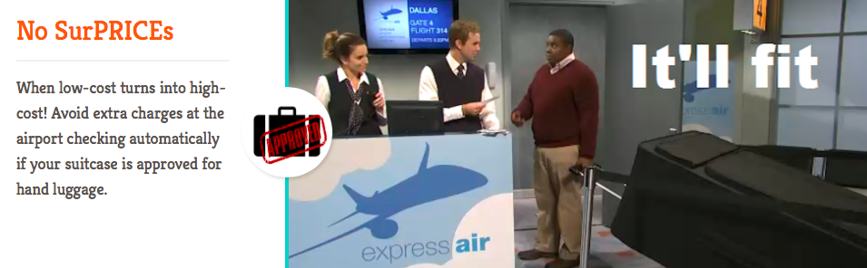
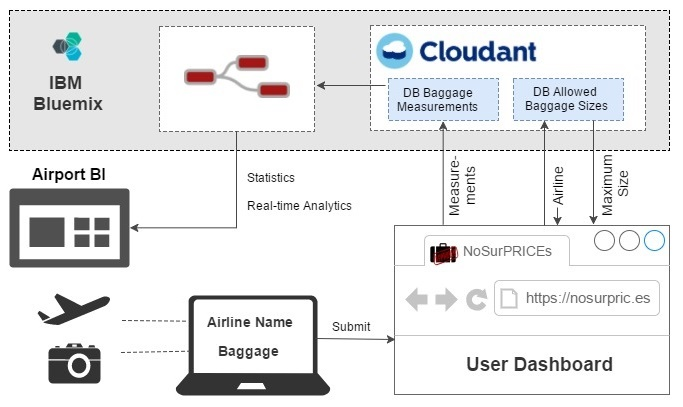

--- WORK IN PROGRESS! ---

# No SurPRICEs

_A fun weekend project by Emelie Hofland and Jaime González-Arintero. Created during the [{re}coding aviation hackathon](http://www.recodingaviation.com) in Berlin, on June 16/17/18, 2017._

## Introduction

Dutch people say that "goedkoop is duurkoop", which means "cheap is expensive". Sometimes, **you want to travel low-cost, and take a small hand luggage. But once in the airport, it turns out that your suitcase is not cabin-approved, and you end up paying extra charges**. Unexpectedly, your low-cost flight turns into high-cost. You end up stressed, and paying more. And it's annoying for everyone!

Click on the picture below to **visit the project page**:

## Description

Our solution consists on an app that, after submitting a picture of your luggage, will check "automagically" if it's approved for the cabin. It will check the size, and if it fits for an specific airline. Besides, it may also calculate the estimated room available in the plane! The airport authorities can know the approximate average size of hand luggages for further analytics, with realtime data.

## Live Dashboard

A **live dashboard displaying real-time values** has been deployed as a Cloud Foundry app, and it's [available in IBM Bluemix](https://no-surprices.eu-gb.mybluemix.net/ui/).

## Solution Architecture

## Business Presentation

The **presentation** is available in [Google Slides](https://docs.google.com/presentation/d/1UIGyUU7l4xgKFQoWxhjXeaxU79P2UAArl4ggs6sJ058/edit?usp=sharing) (**Chrome is recommended**; other browsers such as Safari may show format issues).

<!--

A static **PDF version** can be downloaded [here](./assets/railax-biz-slides.pdf).

The additional pictures used in this presentation are available on [this Google Drive folder](https://drive.google.com/open?id=0B8B9qWtOwkjAS01FYlZyU1liUzg), in the `pics` directory.

-->

## Node-RED Setup

--- WORK IN PROGRESS ---

A step-by-step of the Node-RED setup in Bluemix is available [here](./node-red-setup).

## To-Do

### Post-Hackathon:
* Clean docs when time and mood allows!

## License

Copyright (C) 2017 Emelie Hofland <emelie_hofland@hotmail.com>, Jaime González-Arintero <a.lie.called.life@gmail.com>

Permission is hereby granted, free of charge, to any person obtaining a copy of this software and associated documentation files (the "Software"), to deal in the Software without restriction, including without limitation the rights to use, copy, modify, merge, publish, distribute, sublicense, and/or sell
copies of the Software, and to permit persons to whom the Software is furnished to do so, subject to the following conditions:

The above copyright notice and this permission notice shall be included in all copies or substantial portions of the Software.

Except as contained in this notice, the name(s) of the above copyright holders shall not be used in advertising or otherwise to promote the sale, use or
other dealings in this Software without prior written authorization.

THE SOFTWARE IS PROVIDED "AS IS," WITHOUT WARRANTY OF ANY KIND, EXPRESS OR IMPLIED, INCLUDING BUT NOT LIMITED TO THE WARRANTIES OF MERCHANTABILITY,
FITNESS FOR A PARTICULAR PURPOSE AND NONINFRINGEMENT.  IN NO EVENT SHALL THE AUTHORS OR COPYRIGHT HOLDERS BE LIABLE FOR ANY CLAIM, DAMAGES OR OTHER
LIABILITY, WHETHER IN AN ACTION OF CONTRACT, TORT OR OTHERWISE, ARISING FROM, OUT OF OR IN CONNECTION WITH THE SOFTWARE OR THE USE OR OTHER DEALINGS IN THE
SOFTWARE.