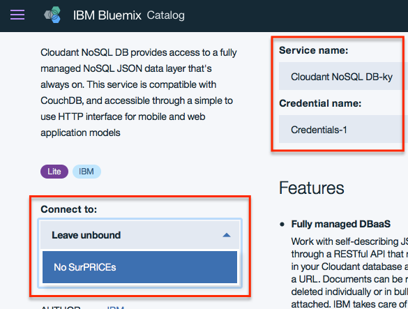

--- WORK IN PROGRESS ---

# Cloudant NoSQL Databases

## Deployment In Bluemix

### Adding the Service

Once logged into the Bluemix platform, head to [**"Data & Analytics"**](https://console.bluemix.net/dashboard/data). You will be redirected to the specific domain of your region, but that is irrelevant for the following steps.

Click on the **blue button "Create Data & Analytics service"**, and select **"Clodant NoSQL DB"**, as shown below.


On the next menu, **introduce a "Service name" and a "Credentials name"**.

On **"Connect to"**, select the application that you'd like to link to. This means that **your database will be accessible from another services**. In this project it was linked to the application _"No SurPRICEs"_, as depicted here:



This will make possible to select the Cloudant database later, from the nodes in the _"No SurPRICEs"_ Node-RED instance.

Before clicking on "Create" (at the bottom of the page), make sure that you select **"Lite" as the pricing plan**. This plan provides 1 GB of data storage, but it's free. Besides, that is much more than what's needed for this project.

Your service will now be available at the "Data & Analytics" page of your Bluemix account. To open it, select the service, and click on "Launch" on the next menu.

### Creating Databases Manually from the User Interface

--- WORK IN PROGRESS ---

## Retrieving Values from the Databases

Currently there are two databases that reside in the Cloudant service:

* **Baggage:** It stores the size of the baggages, and if they're cabin-approved or not.
* **Maximum baggage size per airline:** It contains the sizes of the cabin-approved (i.e. hand luggage) per airline.

### Reader Permissions

Reader permissions have been granted to unauthenticated connections, meaning that these databases can also be used for external projects, without a login.

### Baggage Database

Values can be easily retrieved using a GET request. Here's an example for the "Baggage" database (`baggage`) in cURL:

    $ curl -X GET https://389c0932-8ba8-406b-8730-ff8b76623111-bluemix.cloudant.com/baggage/_id

**Note:** The `_id` at the end of the URL is the "identificator" of the baggage, for example, `4` corresponds to the 4th baggage introduced in the system.

### Maximum Size per Airline Database

The following example retrieves the maximum size of the cabin baggage for KLM:

    $ curl -X GET https://389c0932-8ba8-406b-8730-ff8b76623111-bluemix.cloudant.com/maxsize/KLM

Airline names/identifiers are available in the [raw data file](./max-baggage-size-db.txt).

The response from the Cloudant instance should look like:

```shell
{
	"_id":"KLM",
	"_rev":"1-0058dfe2597cb77b2b52d072d1674b91",
	"baggageWeight":12,
	"baggageDepth":35,
	"baggageWidth":25,
	"baggageHeight":55
}
```

## Resources

* [Cloudant API reference (Bluemix documentation)](https://console.bluemix.net/docs/services/Cloudant/api/index.html#api-reference-overview)
* [Creating and populating a Cloudant database (Bluemix documentation)](https://console.bluemix.net/docs/services/Cloudant/tutorials/create_database.html#creating-and-populating-a-simple-cloudant-database-on-bluemix)
* [Cloudant Python library documentation](http://python-cloudant.readthedocs.io/en/latest/getting_started.html#opening-a-database)