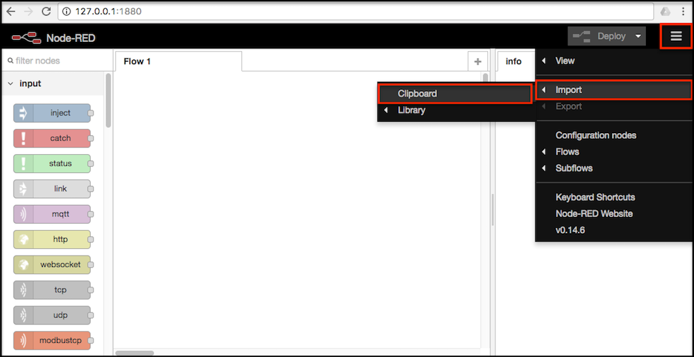

# Node-RED Setup

## Deployment In Bluemix

--- WORK IN PROGRESS ---

## Installing Additional Nodes

The following additional nodes are required for the dashboard to work.

* [UI](): A useful set of widgets to build dashboards.
* [Counter](): Just a simple counter to orchestrate operations.

The easiest way of adding more nodes to our Node-RED instance is using the built-in _palette manager_. To open it, click on the drop-down menu button, on the top right corner, and head to `Manage palette`, as shown below.

On the next step, first click on the tab `Install` (1), and then search the additional nodes on the text box (1). Once found, click on the `Install` button. The following picture shows an example with the node `node-red-node-mysql`.

As said, **make sure you install the ones required for this project**: "UI" (`PACKAGE_NAME_HERE`) and "Counter" (`PACKAGE_NAME_HERE`).

## Importing and Configuring the Flow

In Node-RED, the flows can be **imported** (and exported) using JSON format. For the sake of simplicity, the flow needed to implement this project is available in this repository, and ready to use. On the same folder of this readme file, open and copy the following flow: `node-red-flows.json`.

In Node-RED, click on the button in the top right corner and select `Import` → `Clipboard`, as shown below.

On the next window, paste the raw content of the file `node-red-flows.json`, as mentioned before. Now click on the part of the (until now) blank workspace where you want the flow to be placed.

Once ready, some nodes have to be configured according to your own project, for example, the nodes reference to the original Cloudant NoSQL database generated for the hackathon. Make sure you replace the existing Cloudant URLs  with yours, i.e. `https://<YOUR_CLOUDANT_IDENTIFIER>-bluemix.cloudant.com/`. 

## Deploying the Changes and Visualizing the Dashboard

--- WORK IN PROGRESS ---

## To Do

* Add missing links to the additional nodes.
* Add the package names on the "Installing Additional Nodes" section.
* Specify which nodes to modify, after importing the flow.